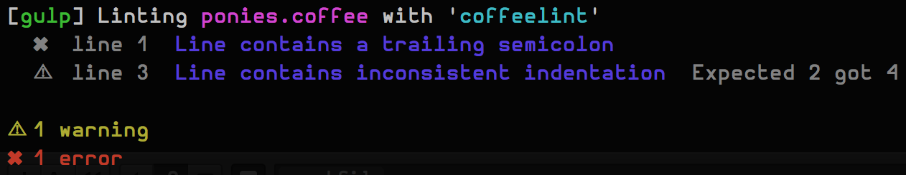

# gulp-coffeelint [![Build Status][travis-image]][travis-url] [![NPM version][npm-image]][npm-url]
[![Dependency Status][depstat-image]][depstat-url] [![devDependency Status][devdepstat-image]][devdepstat-url]

> [CoffeeLint](http://www.coffeelint.org/) plugin for [gulp](https://github.com/wearefractal/gulp)

## Usage

First, install `gulp-coffeelint` as a development dependency:

```shell
npm install --save-dev gulp-coffeelint
```

Then, add it to your `gulpfile.js`:

```javascript
var gulp = require('gulp');
var coffeelint = require('gulp-coffeelint');

gulp.src('./src/*.coffee')
    .pipe(coffeelint())
    .pipe(coffeelint.reporter())
```

Example output:


## Options `coffeelint(opt, literate)`

### opt
Type: `String` or `Object`
Default: `{}`

Options you may wish to send to `coffeelint` (see [http://www.coffeelint.org/#options](http://www.coffeelint.org/#options)) **or** the absolute path of a `.json` file containing such a configuration object.

### literate
Type: `Boolean`
Default: `false`

Are we dealing with literate CoffeeScript here?

## Results

Adds the following properties to the `file` object:
```javascript
file.coffeelint.success = true; // or false
file.coffeelint.errorCount = 0; // number of errors returned by `coffeelint`
file.coffeelint.warningCount = 0; // number of warnings returns by `coffeelint`
file.coffeelint.results = []; // `coffeelint` results, see http://www.coffeelint.org/#api
file.coffeelint.opt = {}; // The options you passed to `coffeelint`
file.coffeelint.literate = false; // Again, this is your doing...
```

## License

[MIT License](http://en.wikipedia.org/wiki/MIT_License) © [Jan Raasch](http://janraasch.com)

[npm-url]: https://npmjs.org/package/gulp-coffeelint
[npm-image]: https://badge.fury.io/js/gulp-coffeelint.png

[travis-url]: http://travis-ci.org/janraasch/gulp-coffeelint
[travis-image]: https://secure.travis-ci.org/janraasch/gulp-coffeelint.png?branch=master

[depstat-url]: https://david-dm.org/janraasch/gulp-coffeelint
[depstat-image]: https://david-dm.org/janraasch/gulp-coffeelint.png

[devdepstat-url]: https://david-dm.org/janraasch/gulp-coffeelint#info=devDependencies
[devdepstat-image]: https://david-dm.org/janraasch/gulp-coffeelint/dev-status.png
